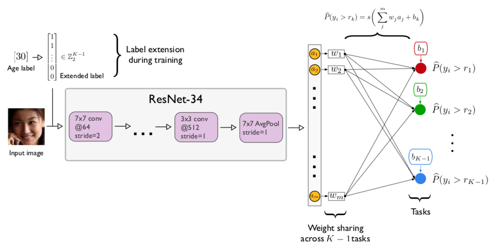

# CORAL: Consistent Rank Logits for Ordinal Regression with Convolutional Neural Networks

This repository contains the model code for the paper

- Wenzhi Cao, Vahid Mirjalili, Sebastian Raschka (2019): *Consistent Rank Logits for Ordinal Regression with Convolutional Neural Networks*  
[[ArXiv Preprint](https://arxiv.org/abs/1901.07884)]



---


## Model code

Note that the model code across datasets
is identical for the different datasets, however, we hard coded
the file paths to the datasets at the top of the file and using dataloaders specific to
the corresponding dataset organization. **You likely need to change the file paths** 
in the scripts depending on where you save the image datasets and label files
if you wish to run the code.

All code was run on PyTorch 1.0 and Python 3.7,
and we do not guarantee upward and downward compatibility
to other PyTorch and Python versions.

The model code can be found in the `./model-code/resnet34` subdirectory, and the code files are labeled using the scheme

```
<dataset>-<loss>.py
```

- `<dataset>` refers to either AFAD (`afad`), MORPH-2 (`morph`), UTKFace (`utk`),
or CACD (`cacd`).

- `<loss>` refers to either CORAL (`coral`), ordinal regression as in Niu et al.
(`ordinal`), or cross-entropy (`ce`).

**Example**

```bash
python afad-coral.py --seed 1 --imp_weight 1 --cuda 0 --outpath afad-model1
```

- `--seed <int>`: Integer for the random seed; used for training set shuffling and
the model weight initialization (note that CUDA convolutions are not fully deterministic).

- `--imp_weight <int>` : If `0`, uses no importance weighted. If `1`, uses the 
task importance weighting as described in the paper.

- `--cuda <int>`: The CUDA device number of the GPU to be used for training 
(`--cuda 0` refers to the 1st GPU).

- `--outpath <directory>`: Path for saving the training log (`training.log`) 
and the parameters of the trained model (`model.pt`). 

## Datasets

### Image files

The image files of the face image datasets are available from the following websites:

- CACD: http://bcsiriuschen.github.io/CARC/

- UTKFace: https://susanqq.github.io/UTKFace/

- AFAD: https://github.com/afad-dataset/tarball

- MORPH-2: https://www.faceaginggroup.com/morph/

### Data preprocessing code

We provide the dataset preprocessing code that we used to prepare the CACD and MORPH-2 datasets
as described in the paper. The code is located in the `./datasets/image-preprocessing-code` 
subdirectory. AFAD and
UTKFace do not need further preprocessing.

### Labels and train/test splits

We provide the age labels (obtained from the orginal dataset resources)
 and train/test splits we used in CSV format located in the `./datasets/train-test-csv`
 subdirectory.

- CACD: labels 0-48 correspond to ages 14-62
- UTKFace: labels 0-39 correspond to ages 21-60
- AFAD: labels 0-25 correspond to ages 15-40
- MORPH-2: labels 0-54 correspond to ages 16-70
