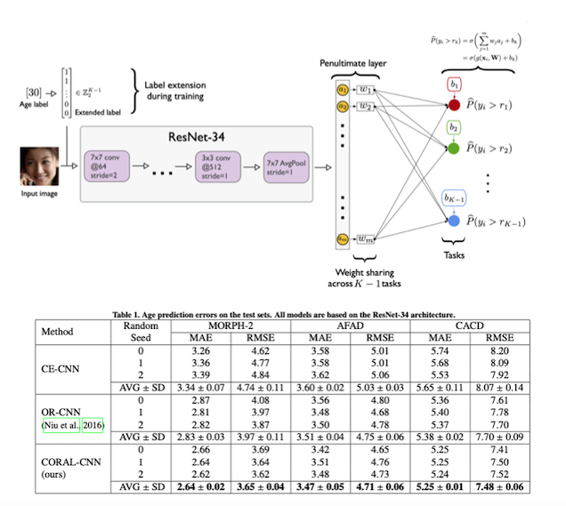
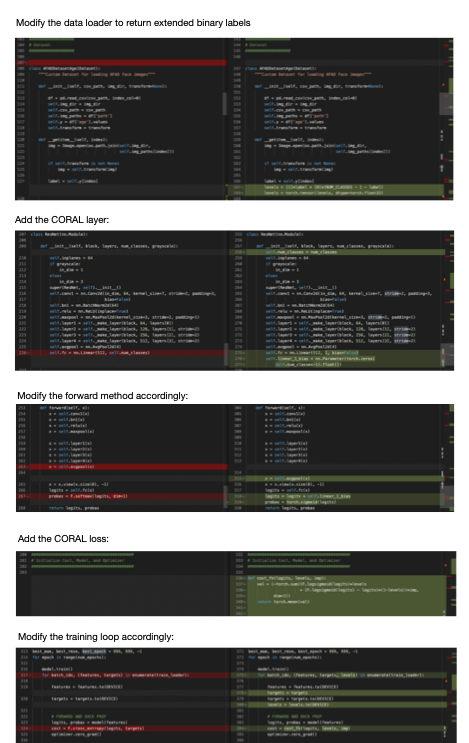

# Rank-consistent Ordinal Regression for Neural Networks

This repository contains the PyTorch model code for the paper

- Wenzhi Cao, Vahid Mirjalili, Sebastian Raschka (2020): *Rank Consistent Ordinal Regression for Neural Networks with Application to Age Estimation*. Pattern Recognition Letters. https://doi.org/10.1016/j.patrec.2020.11.008.     
[[Journal Paper](https://www.sciencedirect.com/science/article/pii/S016786552030413X)] [[ArXiv Preprint](https://arxiv.org/abs/1901.07884)]  
[[PyTorch Package](https://github.com/Raschka-research-group/coral_pytorch)]
[[Keras Port](https://github.com/ck37/coral-ordinal)]



---

This GitHub repository contains the code files and training logs used in the paper. If you are primarily interested in using CORAL, a PyTorch library with Tutorials can be found here:

<a href="https://github.com/Raschka-research-group/coral_pytorch"></a>

- [https://github.com/rasbt/coral_pytorch](https://github.com/Raschka-research-group/coral_pytorch)

---

## PyTorch Model Code

Note that the model code across datasets
is identical for the different datasets, however, we hard coded
the file paths to the datasets at the top of the file and using dataloaders specific to
the corresponding dataset organization. **You likely need to change the file paths** 
in the scripts depending on where you save the image datasets and label files
if you wish to run the code.

All code was run on PyTorch 1.5 and Python 3.7,
and we do not guarantee upward and downward compatibility
to other PyTorch and Python versions.

The model code can be found in the `[./model-code](./model-code)` subdirectory, and the code files are labeled using the scheme

```
<dataset>-<loss>.py
```

- `<dataset>` refers to either AFAD (`afad`), MORPH-2 (`morph`),
or CACD (`cacd`).

- `<loss>` refers to either CORAL (`coral`), ordinal regression as in Niu et al.
(`ordinal`), or cross-entropy (`ce`).


**Example**

The following code trains `coral` on the `afad` dataset:

```bash
python afad-coral.py --seed 1 --cuda 0 --outpath afad-model1
```

- `--seed <int>`: Integer for the random seed; used for training set shuffling and
the model weight initialization (note that CUDA convolutions are not fully deterministic).

- `--cuda <int>`: The CUDA device number of the GPU to be used for training 
(`--cuda 0` refers to the 1st GPU).

- `--outpath <directory>`: Path for saving the training log (`training.log`) 
and the parameters of the trained model (`model.pt`). 


Here is an overview of the differences between a regular CNN and a CORAL-CNN:

[](github-images/differences-at-a-glance.pdf)  
(Click to see a high resolution version.)

---

## Training Logs and Trained Models from the Paper

We share all training logs in this GitHub repository under the [./experiment-logs](experiment-logs) subdirectory. Due to the large file-size (85 Mb per model), we could not share the trained models on GitHub; however, all trained models can be downloaded from Google Drive via the following link: [https://drive.google.com/drive/folders/168ijUQyvGLhHoQUQMlFS2fVt2p5ZV2bD?usp=sharing](https://drive.google.com/drive/folders/168ijUQyvGLhHoQUQMlFS2fVt2p5ZV2bD?usp=sharing).


**Image files**

The image files of the face image datasets are available from the following websites:

- CACD: http://bcsiriuschen.github.io/CARC/

- AFAD: https://github.com/afad-dataset/tarball

- MORPH-2: https://www.faceaginggroup.com/morph/

**Data preprocessing code**

We provide the dataset preprocessing code that we used to prepare the CACD and MORPH-2 datasets
as described in the paper. The code is located in the 
`[./datasets/image-preprocessing-code](./datasets/image-preprocessing-code)` 
subdirectory. AFAD did not need further preprocessing.

**Labels and train/test splits**

We provide the age labels (obtained from the orginal dataset resources)
 and train/test splits we used in CSV format located in the `./datasets/train-test-csv`
 subdirectory.

- CACD: labels 0-48 correspond to ages 14-62
- AFAD: labels 0-25 correspond to ages 15-40
- MORPH-2: labels 0-54 correspond to ages 16-70

---

## Using Trained Models

We share the pre-trained models from the paper that can be used to make predictions on AFAD, MORPH-2, or CACD images. Please see the README in the 
[single-image-prediction__w-pretrained-models](single-image-prediction__w-pretrained-models) subdirectory for details.

---

## Implementations for Other Deep Learning Frameworks

### Porting Guide

Our models were originally implemented in PyTorch 1.5. We provide a recipe for porting the code is provided at [coral-implementation-recipe.ipynb](coral-implementation-recipe.ipynb). Also see the [the file-diff comparing CORAL with regular CNN.](github-images/differences-at-a-glance.pdf)

### Keras

A Keras port of this code was recently developed and made available at [https://github.com/ck37/coral-ordinal](https://github.com/ck37/coral-ordinal).
