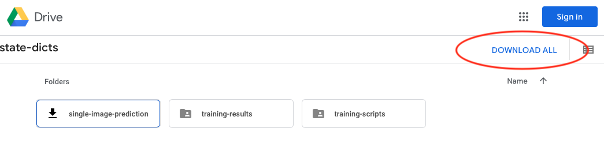
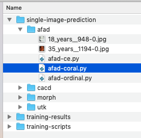

# Single Image Predictions

Due to the large file sizes of the model, the pre-trained models are not available in this GitHub repository but are shared via Google Drive instead. Below are instructions for using these pre-trained models to make predictions on .jpg files.


## 1) Downloading the dataset

Visit the Google Drive link to the `state-dicts` directory via your web browser at https://drive.google.com/drive/folders/1Q9vr5Q0BueHD0Kal2pEmA-NWIbYZnJAL and click on the "Download All" button on the upper right corner (the downloaded files will be ~1GB in total).




## 2) Selecting the model

After downloading and unzipping the files, cd into the "single-image-prediction directory". Inside, you will be able to find a subfolder with a script that can be used to run a model pre-trained on one of the different datasets evaluated in this paper:




## 3) Age prediction

Next, simply execute the script with an example image. For example, you can execute the following in order to execute the CORAL ResNet-34 trained on AFAD:

```bash
python afad-coral.py -i 35_years__1194-0.jpg 
Class probabilities: tensor([[1.0000e+00, 1.0000e+00, 1.0000e+00, 1.0000e+00, 1.0000e+00, 1.0000e+00,
         1.0000e+00, 1.0000e+00, 1.0000e+00, 1.0000e+00, 1.0000e+00, 9.9998e-01,
         9.9991e-01, 9.9966e-01, 9.9883e-01, 9.9557e-01, 9.8391e-01, 9.4708e-01,
         8.4080e-01, 5.8262e-01, 2.3082e-01, 5.3700e-02, 8.9853e-03, 9.9941e-04,
         2.7141e-05]])
Predicted class label: 20
Predicted age: 35
```

Note the class labels in the training sets start at 0, which is why the true age (`Predicted age`) is larger than the predicted label (`Predicted class label`).


## 4) Troubleshooting


 If you get an error such as 

    FileNotFoundError: [Errno 2] No such file or directory: '../../training-results/afad-coral_seed0_imp0/model.pt'

please make sure that you `cd`ed into the directory where the Python script is located. Due to the relative link in that file (linking to the pre-trained models in the `training-results` directory), something like


    python afad/afad-coral.py -i afad/35_years__1194-0.jpg  

will not work (should be `python afad-coral.py -i 35_years__1194-0.jpg`).